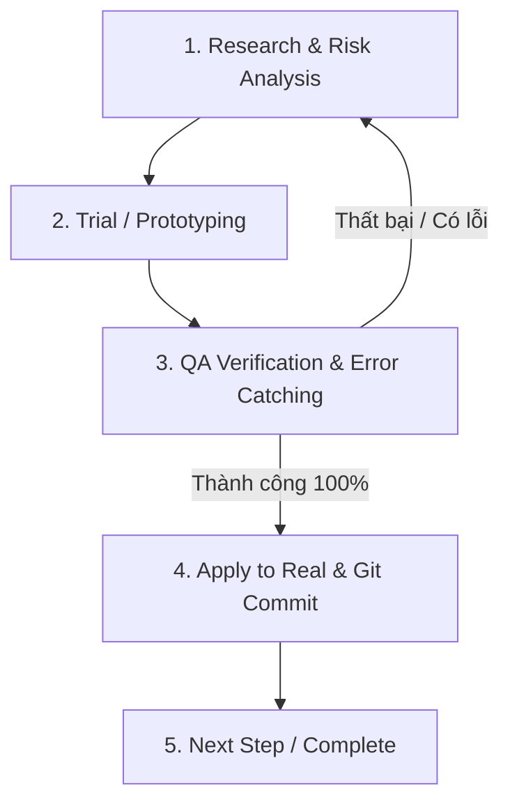

# 🤖 AGENT SYSTEM WORKFLOW SPECIFICATION

## 1. Nguyên tắc cốt lõi (5-Step Autonomous Quality Loop)

Mỗi tính năng / bước trong Roadmap đều phải tuân thủ nghiêm ngặt chu trình 5 bước:

### Chi tiết các bước:
1. **Bước 1: Research & Risk Analysis (Nghiên cứu & Rủi ro)**
   - Subagent `research-risk-analyst` nhận yêu cầu tính năng từ Roadmap.
   - Phân tích kiến trúc, thư viện, luồng dữ liệu, cấu trúc file.
   - Xác định rủi ro kỹ thuật: tương thích bundler (Vite), collision bugs, asset loading paths, socket lag/desync, memory leaks.
   - Đưa ra checklist kỹ thuật và tiêu chí nghiệm thu (Verification Criteria).

2. **Bước 2: Trial / Prototyping (Áp dụng thử)**
   - Viết code hoàn chỉnh dựa trên blueprint từ Bước 1.
   - Cung cấp assets (spritesheet, tileset, sound/config) tự tạo hoặc chuẩn hóa pixel art.
   - Đảm bảo code sạch, module hóa, sẵn sàng mở rộng.

3. **Bước 3: QA Verification & Error Catching (Kiểm tra & Bắt lỗi)**
   - Subagent `qa-verifier` thực hiện kiểm thử tự động:
     - Syntax / Import / Dependency check.
     - Production Build check (`npm run build`).
     - Runtime server initialization check (`node` / `vite`).
     - Logic verification (Phaser scene config, physics arcade body, collision tilemap layer, socket event listeners).
   - Nếu có lỗi -> Ghi nhận log chi tiết, quay lại Bước 1/Bước 2 để fix ngay lập tức.

4. **Bước 4: Apply to Real & Git Commit (Áp dụng thật & Lưu trữ Git)**
   - Khi QA xác nhận 100% PASSED, đồng bộ hóa code chính thức vào project.
   - Tự động thực hiện Git Commit đầy đủ với tác giả là người dùng (`RaH11 <hungnguyen.190206@gmail.com>`).
   - Cập nhật nhật ký trạng thái (`.agent_system/STATE.md`).

5. **Bước 5: Bàn giao & Hướng dẫn kiểm tra trực quan**
   - Cung cấp lệnh khởi chạy dev server rõ ràng để người dùng có thể tự tay mở trình duyệt test ngay.

---

## 2. Thông tin Tác giả Git (Configured Author)
- **User Name**: `RaH11`
- **User Email**: `hungnguyen.190206@gmail.com`
- **Quy ước Commit Message**: `feat/fix/chore(scope): [Mô tả chi tiết tính năng đã verify]`
