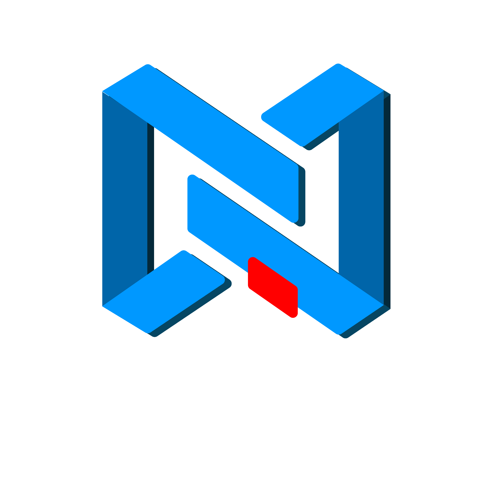
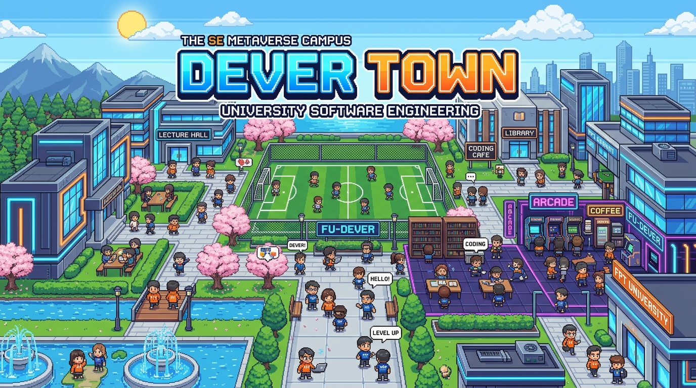

<div align="center">

<a href="https://github.com/huanight19RaH/DEVER_TOWN">
  
</a>

# 🎮 DEVER TOWN

### Thế Giới Metaverse 2D Pixel Art của CLB FU-DEVER · FPT University Đà Nẵng

[](https://www.fudever.com/)
[](./package.json)
[](https://phaser.io)
[](https://nodejs.org)
[](https://socket.io)
[](https://vitejs.dev)
[](./src/config/i18n.js)

<p align="center">
  
</p>

> **WORK HARD - PLAY HARD** · Không gian sinh hoạt số phong cách Gather.town dành riêng cho sinh viên và cộng đồng lập trình viên FPT Đà Nẵng.  
> Gặp gỡ, học tập kỹ thuật, giải trí arcade, thi đấu thể thao ảo và kết nối cùng 25 câu lạc bộ trường FPTU!

🌐 [Website CLB](https://www.fudever.com/) &nbsp;·&nbsp; 📘 [Fanpage FU-DEVER](https://www.facebook.com/FPTUDever) &nbsp;·&nbsp; 📝 [Đăng Ký Thành Viên](https://forms.gle/2us1yB5Qp2HYejj28) &nbsp;·&nbsp; 🐙 [GitHub Org](https://github.com/fudever-club)

</div>

---

## 🌟 Giới Thiệu Tổng Quan

**DEVER TOWN** là nền tảng Metaverse 2D Pixel Art Top-down hoàn chỉnh xây dựng trên nền **Phaser 3** và **Socket.io**. Nền tảng mô phỏng khuôn viên số của Đại học FPT Đà Nẵng, kết hợp giữa:
- **Không gian học thuật & sự kiện:** Tòa Alpha 3 tầng, Lab AI, Thư viện tri thức, bảng vẽ Excalidraw, JS Sandbox, Lofi Radio.
- **Hệ sinh thái cộng đồng:** Gian hàng giới thiệu của 25 CLB FPTU, đối thoại cùng 10 NPC Ban Điều Hành CLB.
- **Đấu trường giải trí:** 6 minigames thể thao và arcade cổ điển vận hành theo cơ chế vật lý tương tác trực tiếp.

```
                              ┌───────────────────────┐
                              │   TÒA ALPHA (SẢNH)   │
                              │   Linh vật Cóc Vàng   │
                              └───────────┬───────────┘
             ┌────────────────────────────┼────────────────────────────┐
             ▼                            ▼                            ▼
  ┌───────────────────────┐   ┌───────────────────────┐   ┌───────────────────────┐
  │   TÒA GAMMA (LAB)     │   │ TÒA BETA (THƯ VIỆN)   │   │  KHU THỂ THAO FUDA    │
  │ Code Sandbox + Server │   │ PE SWE201c + Lofi Pomo│   │ 11m + Bóng Rổ + Bơi   │
  └──────────┬────────────┘   └───────────────────────┘   └───────────────────────┘
             │
             ▼
  ┌───────────────────────┐   ┌───────────────────────┐   ┌───────────────────────┐
  │ ARCADE & ROBOT HUB    │   │  KHÔNG GIAN WEB & IT  │   │  CĂN TIN & CAFE LOUNGE│
  │ Snake, Sokoban, Gold  │   │ Landing + IT Helpdesk │   │ Thực đơn thật + Barista│
  └───────────────────────┘   └───────────────────────┘   └───────────────────────┘
```

---

## 🗺️ 1. Bản Đồ & 9 Phân Khu Chức Năng

| Phân Khu | Tên & Đặc Điểm | Vùng Tương Tác `[E]` Nổi Bật |
|:---|:---|:---|
| 🏛️ **Tòa Alpha (3 Tầng)** | **Tầng 1:** Sảnh chính đón tiếp & Cóc Vàng tâm linh<br>**Tầng 2:** Hub Học Thuật & Khởi Nghiệp (9 gian hàng CLB)<br>**Tầng 3:** Hub Nghệ Thuật, Thể Thao & Kỹ Năng (10 CLB) | Logo & Backdrop 25 CLB trường FPTU, Cầu thang chuyển tầng, Sân khấu sự kiện, Bàn tiếp đón Thư ký |
| 💻 **Tòa Gamma (Tech Lab)** | Không gian Hackathon, máy chủ và trạm code nhóm | Code Sandbox chạy code trực tiếp, Bảng vẽ kiến trúc Excalidraw |
| 📚 **Tòa Beta (Thư Viện)** | Không gian tự học yên tĩnh và ôn luyện | Cẩm nang PE môn SWE201c, Quy chế CLB, Quầy Cafe Lofi & Pomodoro |
| 🕹️ **Arcade & Robot Hub** | Khu máy game thùng retro phong cách Cyberpunk | Rắn Săn Mồi 60fps, Đẩy Hộp Sokoban 15 màn, Vua Đào Vàng nổ TNT |
| ⚽🏀 **Khu Phức Hợp Thể Thao** | Sân cỏ nhân tạo, sân bóng rổ, cầu lông, hồ bơi | Sút Phạt Đền 11M, Ném Bóng Rổ Parabol, Bóng Chuyền bãi biển 1v1 |
| ☕🍽️ **Căn Tin & Cafe Lounge** | Ẩm thực sinh viên & quầy pha chế đồ uống | Thực đơn 3 căn tin FPTU, Minigame Barista (phân tầng nước & vẽ Latte Art) |
| 🏆 **Phòng Kỷ Niệm** | Nhà truyền thống vinh danh 9+ năm FU-DEVER | Bảng vàng thành tích ICPC & Hackathon, Album ảnh sinh hoạt CLB |
| 🌐 **Không Gian Số & IT** | Cổng dịch vụ kỹ thuật và công nghệ thông tin | Cổng EOS/PE, IT Helpdesk, Landing Page, Tuyển thành viên Gen 10 |
| 🍵 **Vườn Trà FUDA** | Góc sân vườn ngoài trời tĩnh lặng, thoáng mát | Bàn trà đàm đạo, ghế đá thư giãn dưới tán hoa anh đào |

---

## 👥 2. Nhân Vật & Tủ Đồ (Character Presets & Gear)

### 2.1. Bộ Sưu Tập 19 Nhân Vật Hoàn Chỉnh (`CHARACTER_PRESETS`)
Tủ đồ được tổ chức thành **3 Tab Lọc Tiện Lợi**: `Chung (Tất Cả)`, `Nhân Vật Nam`, `Nhân Vật Nữ`. Toàn bộ nhân vật là tác phẩm Chibi Pixel Art 48×64 px pre-baked sắc nét:
- **Nhân vật Nam:** *Nam Dev FU-DEVER, Nam Leader K20, Nam Sinh Viên FPTU, Nam Cán Bộ FPTU, Nam Dev Hackathon, Nam Thuyết Trình Tech CEO, Nam Vận Động Viên, Cyber Hacker Terminal, Biker Phượt Thủ...*
- **Nhân vật Nữ:** *Nữ Sinh Áo Dài Trắng, Nữ Sinh Áo Dài FPTU Cách Tân, Nữ Streamer Cyber Gamer, Nữ Barista Cà Phê Căn Tin, Nữ Sinh Viên Dễ Thương...*
- **Đặc biệt & Linh thú:** *Võ Sinh Vovinam FPTU (võ phục xanh đai vàng truyền thống), Phù Thủy Thuật Toán Code, Cyber Mecha Android, Linh Vật Cóc Vàng FPTU.*

### 2.2. Túi Đồ & Vật Phẩm Cầm Tay Trực Tiếp (`[I]`)
Vật phẩm được gắn trực tiếp trên tay nhân vật khi di chuyển:
- 💻 **MacBook Pro Dev** — Màn hình phát sáng xanh cyber khi gõ code.
- ☕ **Ly Cà Phê Muối Đà Nẵng** — Phân tầng cà phê muối và làn khói nghi ngút.
- 🐸 **Gấu Bông Cóc Vàng** — Ôm chú cóc vàng may mắn trước ngực.
- 🚩 **Cờ Hiệu FU-DEVER** — Cán gỗ dài, lá cờ xanh bay phấp phới.
- ⚽🏀 **Bóng Đá & Bóng Rổ** — Kẹp bóng bên hông sẵn sàng thi đấu.

### 2.3. Hội Thoại Cùng 10 NPC Ban Điều Hành CLB
Khi tiếp cận NPC và bấm phím `[E]`, game tự động đo khoảng cách Euclid để mở đúng hộp thoại của NPC gần nhất:
- **Chủ Nhiệm Đặng Quang Nhật** (Bàn trái sảnh Alpha)
- **Phó Chủ Nhiệm Nguyễn Thái Hưng** (Bàn phải sảnh Alpha)
- **Thư Ký Nguyễn Thị Ngọc Ánh** (Quầy tiếp đón trung tâm)
- Cùng các Trưởng ban: *Barista An, Học vụ Kiệt, Game Lead Thành, Sự kiện Thắng, Media Hải, Sử quan Đức, Backend Khoa, Thuật toán Truyền.*

---

## 🕹️ 3. Trung Tâm Trò Chơi Mini-Games

### ⚽ Minigame Thể Thao Arcade ([`SportsArcade.js`](./src/ui/minigames/SportsArcade.js))
1. **Sút Phạt Đền 11M (Penalty Shootout):** Sút bóng uốn cong vượt hàng rào chắn hoặc hóa thân thủ môn bay người bắt bóng; lưới bóng đá lò xo rung sóng chân thực.
2. **Ném Bóng Rổ Parabol (Basketball Shootout):** Căn lực ném xiên parabol, hiệu ứng xé lưới **SWISH!**, chuỗi ném cháy rổ **ON FIRE! 🔥**.
3. **Bóng Chuyền 1v1 (Volleyball Rally):** Vòm đầu phản xạ đàn hồi, nhảy đập bóng Spike cắm sân, thi đấu cùng AI 3 cấp độ.
4. **Barista Simulator (Căn Tin FUDA):** Nhận đơn hàng, rót chất lỏng phân tầng tỷ trọng, đánh bọt kem và tự do vẽ Latte Art.

### 👾 Minigame Cổ Điển ([`RetroArcade.js`](./src/ui/minigames/RetroArcade.js))
1. **Rắn Săn Mồi 60FPS (Snake Engine):** Chuyển động mượt mà không giật ô, nút bứt tốc Turbo-Burn, 5 loại vật phẩm và hiệu ứng CRT cổ điển.
2. **Đẩy Hộp Trí Tuệ (Sokoban Engine):** 15 màn chơi kinh điển từ dễ đến khó, sàn băng trơn trượt, tính năng Undo vô hạn.
3. **Vua Đào Vàng (Gold Miner Engine):** Thả móc xích cơ học, nổ dây chuyền thùng thuốc nổ TNT, cửa hàng sắm thuốc nổ và nước tăng lực.

---

## ⌨️ 4. Bảng Phím Điều Khiển

| Thao Tác | Phím Tắt PC | Cảm Ứng Mobile / Tablet |
|:---|:---|:---|
| **Di Chuyển 4 Hướng** | `W A S D` hoặc `Phím Mũi Tên` | D-Pad Ảo (Góc Trái) |
| **Tương Tác Sự Kiện / NPC** | `Phím E` hoặc `Space` | Nút Lớn `[E]` (Màu Cam) |
| **Mở Tủ Đồ & Nhân Vật** | Bấm nút Tủ Đồ trên HUD | Nút `[👗]` |
| **Mở Túi Đồ Cầm Tay** | `Phím I` | Nút `[🎒]` |
| **Biểu Cảm & Nhảy Múa** | `Phím G` | Nút `[✨]` |
| **Đấu Trí Code Siêu Tốc** | `Phím Z` | Nút `[⚡]` |
| **Bật / Tắt Radar HUD** | `Phím M` | Thanh `[RADAR HUD ⌄]` |
| **Mở Khung Chat** | `Phím Enter` | Nút `[💬]` |
| **Đóng Cửa Sổ / Thoát** | `Phím Esc` | Nút `✕` trên Modal |

---

## 🚀 5. Hướng Dẫn Cài Đặt & Khởi Chạy

### Yêu cầu môi trường
- **Node.js**: Phiên bản `18.x` trở lên
- **npm**: Phiên bản `9.x` trở lên

### Khởi chạy dự án
```bash
# 1. Clone kho lưu trữ
git clone https://github.com/huanight19RaH/DEVER_TOWN.git
cd DEVER_TOWN

# 2. Cài đặt các gói phụ thuộc
npm install

# 3. Khởi chạy đồng thời Frontend và Backend Server
npm start

# Hoặc khởi chạy riêng biệt:
npm run dev      # Khởi chạy Vite Frontend (http://localhost:5173)
npm run server   # Khởi chạy Node.js Server (http://localhost:3000)

# 4. Biên dịch bản phát hành (Production Build)
npm run build
```

---

## 🛠️ Công Nghệ Phát Triển (Tech Stack)

```
Frontend     │  Phaser 3.88 (2D WebGL Engine) + Vite 6 + Vanilla JS ES Modules
Backend      │  Node.js 18+ + Express 4 + Socket.io 4 (WebSocket Realtime)
Database     │  PostgreSQL Supabase (Production AWS) + Local JSON DB Adapter
Testing      │  Playwright E2E Suite (58/58 Tests Passed 100%)
Audio        │  Web Audio API Synthesizer 8-bit procedural sound
Styling      │  Cyberpunk Glassmorphism Design System + Neon Palette
Deployment   │  Docker + Vercel (Frontend) + Render / AWS (Backend)
```

---

## 💡 Nguồn Cảm Hứng & Tri Ân (Inspirations & Credits)

DEVER TOWN là dự án sinh thái kỹ thuật số nội bộ, phi thương mại phục vụ sinh viên và thành viên CLB Lập trình FU-DEVER. Dự án được nghiên cứu và phát triển from scratch dựa trên nguồn cảm hứng từ các tựa game và nền tảng kinh điển:

- **Gather.town** — Cảm hứng về mô hình không gian số 2D tương tác cộng đồng, hội họp và kết nối trực tuyến theo khoảng cách lân cận (*proximity video/voice interaction*).
- **DELVERIUM** — Cảm hứng về hệ thống thám hiểm hầm ngục ngầm, ánh sáng ambient dynamic thời gian thực và cơ chế tương tác game feel sâu sắc.
- **Pokémon GBA Series (Game Freak / Nintendo)** — Cảm hứng về phong cách nghệ thuật Pixel Art Top-down overworld, cơ chế di chuyển theo lưới ô vuông và các hiệu ứng tương tác sinh động với môi trường.
- **Stardew Valley (ConcernedApe)** — Cảm hứng về phối cảnh Oblique 2.5D, sắp xếp chiều sâu layer hiển thị (*Y-sort depth*), không gian ấm cúng và trải nghiệm đa tầng.
- **Phaser 3 Game Engine (Photon Storm)** — Nền tảng game engine 2D mã nguồn mở mạnh mẽ vận hành thế giới WebGL / Canvas của DEVER TOWN.

> ⚖️ **Tuyên bố sở hữu trí tuệ & miễn trừ trách nhiệm**: Mọi thương hiệu, tên thương mại, phong cách nghệ thuật gợi nhớ và quyền sở hữu trí tuệ của các tựa game/nền tảng kể trên đều thuộc quyền sở hữu của các tác giả và đơn vị phát hành tương ứng. DEVER TOWN được xây dựng hoàn toàn từ đầu bởi đội ngũ kỹ thuật CLB FU-DEVER phục vụ học thuật, rèn luyện kỹ năng và phong trào sinh viên Đại học FPT Đà Nẵng.

---

## 📜 Bản Quyền & Tác Giả

Dự án là sản phẩm độc quyền được sáng lập, nghiên cứu và phát triển bởi tác giả cùng **CLB Lập trình FU-DEVER · Đại học FPT Đà Nẵng**.

- **Trưởng dự án & Tác giả chính:** [RaH11 (Nguyễn Thái Hưng)](https://github.com/huanight19RaH) · `hungnguyen.190206@gmail.com`
- **Đơn vị phát triển:** Ban Kỹ Thuật CLB FU-DEVER
- Bản quyền © 2026 **FU-DEVER Club · FPT University Da Nang**. All rights reserved.

<div align="center">

**Made with ❤️ by FU-DEVER · WORK HARD - PLAY HARD**

[🌐 Website](https://www.fudever.com/) &nbsp;·&nbsp;
[📘 Fanpage](https://www.facebook.com/FPTUDever) &nbsp;·&nbsp;
[🏛️ FPT University Da Nang](https://danang.fpt.edu.vn/) &nbsp;·&nbsp;
[🐙 GitHub Org](https://github.com/fudever-club)

</div>
