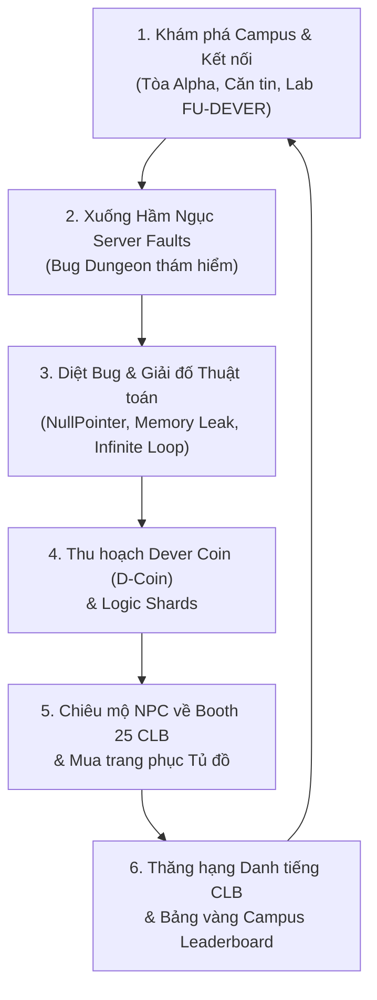

# DEVER_TOWN — Minimum Viable Product (MVP) Launch Specification & GTM Blueprint

> **Phiên bản:** 1.0.0 (MVP Release Candidate)  
> **Chủ quản:** CLB Học Thuật Lập Trình FU-DEVER — Trường Đại Học FPT Đà Nẵng  
> **Mục tiêu:** Định hình sản phẩm khả dụng tối thiểu (MVP) sẵn sàng triển khai thực tế và đưa ra thị trường phục vụ sinh viên CNTT, các CLB FPTU và cộng đồng lập trình.

---

## 🧭 1. Tầm Nhìn & Định Vị Sản Phẩm (Product Vision & UVP)

### 1.1. Tuyên ngôn định vị (Positioning Statement)
**DEVER_TOWN** là **Thế giới Ảo Gamified 2D Pixel Web-based dành cho sinh viên Đại học FPT Đà Nẵng**, nơi kết hợp giữa văn hóa học đường Gather.town, không gian sinh hoạt của 25 CLB sinh viên, và cơ chế thám hiểm/diệt bug lấy cảm hứng từ tựa game indie *Delverium*.

### 1.2. Vấn đề thị trường (Problem Statement)
- **Thiếu sân chơi tương tác trực quan:** Các kênh Discord, Facebook Group, Zalo sinh viên hiện tại chỉ mang tính text/chat phẳng, dễ trôi tin và thiếu cảm xúc gắn kết.
- **Tân sinh viên khó tiếp cận CLB:** Vào đầu năm học (Club Day, Tuần lễ định hướng), tân sinh viên bị ngợp thông tin giữa hàng chục CLB mà không có cơ hội trải nghiệm thực tế.
- **Học thuật lập trình bị khô khan:** Sinh viên năm nhất, năm hai dễ nản khi tiếp cận các môn cấu trúc dữ liệu, thuật toán (SWE201c, PRO192, PRF192).

### 1.3. Đề xuất Giá trị Độc bản (Unique Value Proposition - UVP)
1. **Zero-Install (100% Web):** Truy cập ngay qua link trình duyệt trên cả PC và Mobile dưới 3 giây, đăng nhập 1 chạm với Google Email sinh viên FPT (`@fpt.edu.vn`) hoặc Guest ID.
2. **Bản sắc FPTU & FU-DEVER:** Tòa Alpha, Căn tin Cà phê muối, Mascot Chú Bọ Buggy, Cóc Vàng, Võ phục Vovinam, Áo Dài cam, và 25 Gian hàng CLB chính thức.
3. **Vòng lặp Game hóa Delverium (The Core Loop):** Không chỉ đứng tán gẫu, sinh viên xuống **Hầm Ngục Sự Cố Server (Bug Dungeon)** để săn bắt bọ code, thu thập **Dever Coin (`D-Coin`)**, rồi dùng D-Coin để **Chiêu mộ NPC về phát triển gian hàng CLB của mình**.

---

## 🔄 2. Vòng Lặp Trải Nghiệm Cốt Lõi (The Core MVP Loop)

1. **Khám Phá (Explore):** Chọn trang phục Chibi Gather.town v2 độc bản, di chuyển 4 hướng mượt mà, bước vào sảnh trường.
2. **Chiến Đấu / Giải Mã (Action):** Tiến vào cửa hầm Tòa Gamma (Server Room Basement), giải quyết các điểm nghẽn hệ thống (Server Faults).
3. **Thu Hoạch (Reward):** Nhận điểm thưởng và Dever Coin (`🪙 D-Coin`).
4. **Xây Dựng & Tái Đầu Tư (Build & Flex):** Đầu tư D-Coin vào Gian hàng CLB của mình (mở khóa đại diện NPC CLB, tăng chỉ số uy tín) hoặc diện đồ hiệu trong Tủ đồ.

---

## 📦 3. Phạm Vi Sản Phẩm MVP (MVP Scope Boundary)

Để đưa sản phẩm ra thị trường **nhanh nhất, ổn định nhất, không bị phình to phạm vi (feature creep)**, các tính năng được phân định rạch ròi theo mô hình MoSCoW:

### 3.1. BẮT BUỘC CÓ (MUST-HAVE — Điều kiện để Launch)
- [x] **Hệ Thống Nhân Vật Gather.town v2 Chuẩn Hóa:**
  - 6 Mẫu avatar độc bản (Nam Dev, Nữ Sinh FPTU, Cyber Hacker, Phù Thủy, Biker, Barista).
  - 11 NPC Ban Quản Trị CLB FU-DEVER có khuôn mặt sắc nét, chuẩn tỷ lệ, bước chân 4 hướng không quay ngược đầu.
  - Bộ trang phục đặc sắc: Mascot Bọ Buggy FU-DEVER, Cóc Vàng FUDA, Võ phục Vovinam, Áo Dài FPTU.
- [x] **Tủ Đồ & Kinh Tế Dever Coin (`D-Coin`):**
  - Hiển thị số dư D-Coin viền vàng thời gian thực trên thanh header modal.
  - Phân tab danh mục chuẩn không emoji: *Tất Cả, Nhân Vật Nam, Nhân Vật Nữ, Mascot & Linh Vật*.
  - Lưu trữ bền vững đồng bộ qua `AuthService` và `localStorage`.
- [x] **Không Gian Bản Đồ FPTU & 25 Gian Hàng CLB:**
  - Tòa Alpha 3 tầng, Căn tin cà phê muối, Lab nghiên cứu FU-DEVER, Thư viện học thuật, Sân thể thao.
  - 25 Gian hàng CLB FPTU đầy đủ backdrop 3x3m, thông tin ban chủ nhiệm, slogan, kênh liên hệ.
- [ ] **Phân Khu Hầm Ngục Sự Cố Server (Bug Dungeon MVP):**
  - Bản đồ hầm ngục `server_dungeon` nối trực tiếp từ Lab FU-DEVER.
  - 3 điểm sự cố kinh điển: *NullPointerException Glitch*, *Memory Leak Slime*, *Infinite Loop Matrix*.
  - Mini-puzzle debug nhận D-Coin tức thì.
- [ ] **Cơ Chế Chiêu Mộ NPC Về Booth 25 CLB:**
  - Nút bấm *"Chiêu Mộ Đại Diện CLB"* (500 D-Coin) tại modal Gian hàng CLB.
  - Đánh dấu trạng thái CLB đã có đại diện, mở khóa huy hiệu vinh danh.
- [x] **Mạng Lưới Kết Nối Trực Tuyến:**
  - Socket.io multiplayer đồng bộ vị trí, chat lân cận (proximity chat), whisper cá nhân.
  - Tự động fallback chơi mượt mà ở chế độ offline / single-player nếu mất kết nối server.

### 3.2. NÊN CÓ (SHOULD-HAVE — Cập nhật trong v1.1 ngay sau Launch)
- Bảng xếp hạng Top CLB có nhiều NPC được chiêu mộ nhất trường.
- Âm thanh bước chân đa địa hình (đá hoa, gỗ, thảm, sàn hầm ngục sắt).
- Hiệu ứng ánh sáng động 2D (Dynamic 2D Torch / Flashlight) trong phòng tối.

### 3.3. TẠM HOÃN NGOÀI PHẠM VI MVP (COULD-HAVE / OUT-OF-SCOPE)
- *Loại bỏ PVP thời gian thực phức tạp:* Không làm hệ thống đánh nhau giữa người chơi để tránh mất cân bằng và nặng tải network.
- *Loại bỏ nạp tiền thật (No In-App Purchases):* 100% kinh tế D-Coin dựa trên hoạt động học tập, làm nhiệm vụ và giải đố trong trường.
- *Loại bỏ trình dựng map tự do (No Sandbox Map Editor):* Bản đồ được thiết kế tĩnh tối ưu hóa 60 FPS để tải cực nhanh trên điện thoại.

---

## 📐 4. Chi Tiết Kỹ Thuật Hạng Mục Hầm Ngục & Chiêu Mộ (Phase 2 MVP Implementation)

### 4.1. Cấu hình Bản Đồ `server_dungeon` (Maps Config)
- **Tọa độ kết nối:** Cổng Portal tại `dever_lab` (Tòa Gamma) dẫn xuống hầm ngục.
- **Kích thước:** $25 \times 19$ ô gạch ($800 \times 608\text{ px}$).
- **Không khí mỹ thuật:** Nền gạch xám đậm, máy chủ Server Racks nhấp nháy đèn LED đỏ/xanh, dây cáp mạng neon chạy dọc sàn, ánh sáng mờ huyền bí.
- **Các Interactive Zones trong hầm:**
  1. `zone_dungeon_nullpointer`: Điểm chập cáp rò rỉ mã lỗi `NullPointerException` $\rightarrow$ Nhận diện và bắt giá trị `null` $\rightarrow$ Thưởng $+50\text{ D-Coin}$.
  2. `zone_dungeon_memoryleak`: Bể chứa rò rỉ bộ nhớ RAM `Memory Leak Slime` $\rightarrow$ Giải phóng biến rác (Garbage Collector) $\rightarrow$ Thưởng $+75\text{ D-Coin}$.
  3. `zone_dungeon_infiniteloop`: Vòng xoay ma trận lặp vô tận `Infinite Loop Matrix` $\rightarrow$ Chèn điều kiện dừng `break` $\rightarrow$ Thưởng $+100\text{ D-Coin}$.
  4. `zone_dungeon_terminal`: Máy trạm trung tâm kiểm soát an ninh hệ thống $\rightarrow$ Tổng kết chiến dịch và xem bản tin server.

### 4.2. Cơ Chế Chiêu Mộ Đại Diện CLB (NPC Club Settlement)
- Trong giao diện Gian hàng CLB (`setupClubBoothView`), bổ sung khối thông tin:
  - **Trạng thái Đại Diện CLB:** Chưa có đại diện $\rightarrow$ Đã chiêu mộ thành công.
  - **Nút hành động:** `Chiêu Mộ Đại Diện (500 D-Coin)`.
  - Khi bấm: Trừ $500\text{ D-Coin}$ từ ví người chơi, lưu mảng `recruitedClubs` vào `localStorage`, hiển thị phù hiệu *"Đã Có Đại Diện Định Cư"* kèm lời cảm ơn từ Ban chủ nhiệm CLB đó.

---

## 📈 5. Kế Hoạch Đưa Ra Thị Trường (Go-To-Market / GTM Timeline)

| Giai Đoạn | Thời Gian | Mục Tiêu & Hoạt Động Cụ Thể | Tiêu Chí Đo Lường (KPIs) |
| :--- | :--- | :--- | :--- |
| **Giai đoạn 1: Alpha Internal** | Tuần 1 | • Kiểm thử nội bộ Ban Điều Hành FU-DEVER (15 thành viên). • Chạy Playwright E2E test, kiểm tra FPS trên 5 dòng máy khác nhau. • Rà soát 25 booth CLB đảm bảo logo, backdrop và slogan chuẩn xác 100%. | • 0 lỗi crash nghiêm trọng. • Tốc độ load web $< 3\text{ giây}$. • Duy trì 60 FPS ổn định. |
| **Giai đoạn 2: Closed Beta với 25 CLB** | Tuần 2 | • Mời Ban Chủ Nhiệm của 25 CLB FPTU vào trải nghiệm không gian và kiểm tra gian hàng của CLB mình. • Khởi động minigame: CLB nào chiêu mộ đủ 10 đại diện đầu tiên sẽ được vinh danh trên Fanpage FU-DEVER. | • Ít nhất 20/25 CLB kích hoạt booth. • 150+ sinh viên tham gia test kín. • Tỷ lệ hài lòng $> 90\%$. |
| **Giai đoạn 3: Public Launch (Club Day FPTU)** | Tuần 3 | • Ra mắt chính thức tại sự kiện Ngày Hội CLB (Club Day) / Chào đón Tân sinh viên K22. • Đặt mã QR trải nghiệm trực tiếp tại booth FU-DEVER. • Sự kiện *"Săn Bug Hầm Ngục Nhận Quà Thật"*: Tích lũy 1,000 D-Coin đổi ngay ly Cà phê muối thật tại Căn tin hoặc bộ sticker Buggy. | • 1,000+ sinh viên truy cập trong 48h. • Đạt mốc 10,000+ D-Coin được lưu thông. • Lan tỏa thương hiệu FU-DEVER. |

---

## 🎯 6. Tiêu Chuẩn Nghiệm Thu Kỹ Thuật (MVP Definition of Done)

1. **Hiệu năng & Khả năng tương thích:**
   - Hoạt động mượt mà trên Chrome, Safari, Edge, Firefox trên cả Windows, macOS, Android, iOS.
   - Bundle size sau khi nén Gzip $\le 600\text{ KB}$ cho JavaScript lõi.
2. **Quy chuẩn Code & Quy định CLB:**
   - Tuân thủ 100% **Quy chuẩn kiểm soát Emoji**: Không dùng emoji bừa bãi trên nút bấm (CTA), tab hoặc nhãn `[E]`.
   - Phân nhánh Git: Toàn bộ code game commit và push lên nhánh `develop_hung`, chỉ merge `main` khi có lệnh.
   - Author commit: `RaH11 <hungnguyen.190206@gmail.com>`.
