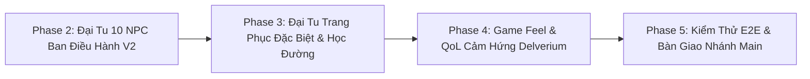

# DEVER_TOWN — Kế Hoạch Nâng Cấp Hệ Thống Nhân Vật Gather.town v2 & Gameplay Delverium (2026)

Tài liệu quy hoạch chi tiết các giai đoạn phát triển tiếp theo của thế giới ảo sinh viên 2D Pixel Multiplayer **DEVER_TOWN** thuộc CLB Học thuật Lập trình FU-DEVER (Đại học FPT Đà Nẵng).

---

## 📌 Bối Cảnh & Thành Quả Đã Đạt Được (Current Baseline)
- **Chuẩn Mỹ Thuật Gather.town v2:** Đã hoàn thiện 6 mẫu nhân vật độc bản đầu tiên tại `public/assets/characters/samples_v2/` với kỹ thuật viền chọn lọc *Selective Outlining (Sel-out)*, mắt 2-pixel phản quang sáng, nhún người *1-pixel Stride Dip* và chu kỳ bước chân 9 FPS.
- **Khắc Phục Triệt Để Lỗi Giật Hướng (Direction Normalization):** Đã chuẩn hóa toàn bộ 36 spritesheets trong game qua script `scripts/fix_spritesheet_directions.py`. Row 1 nhìn Trái 100% (`L L L L`), Row 2 nhìn Phải 100% (`R R R R`), loại bỏ vĩnh viễn lỗi quay ngược đầu khi di chuyển ngang.
- **Hoàn Thiện 11 NPC CLB:** Đã bổ sung spritesheet chuẩn cho Thư Ký Nguyễn Thị Ngọc Ánh (`npc_thuky_anh.png`), tích hợp vào `BootScene.js`, `wardrobe.js` và `character_preview.html`.
- **Sân Thử Di Chuyển Thời Gian Thực (Interactive Walk Tester):** Hoạt động mượt mà tại `character_preview.html` với đầy đủ 4 nhóm nhân vật điều khiển phím WASD.

---

## 🗺️ Lộ Trình 4 Chặng Tiếp Theo (Roadmap Overview)

---

## 🚀 Chi Tiết Các Giai Đoạn Triển Khai

### 🎯 PHASE 2: ĐẠI TU ĐỒ HỌA 10 NPC BAN ĐIỀU HÀNH CLB THEO CHUẨN V2
Nâng cấp toàn diện tạo hình của 10 NPC còn lại từ chuẩn Phase 2 cũ lên chuẩn Gather.town v2 với thần thái sống động, tóc 3D cel-shading bồng bềnh và viền Sel-out mềm mại:

1. **Chủ nhiệm Đặng Quang Nhật (`npc_chunhiem_nhat`):** Undercut đen highlight xám tro, kính dev gọng bạc, áo Polo xanh công nghệ FU-DEVER chính khóa, phong thái tự tin bản lĩnh.
2. **Phó Chủ nhiệm Nguyễn Thái Hưng (`npc_pho_hung`):** Tóc Wolf cut bồng bềnh màu indigo trầm, áo hoodie tím than công nghệ, nụ cười tươi thân thiện chào đón tân sinh viên.
3. **Trưởng ban Học thuật Lương Văn Tuấn Kiệt (`npc_hocthu_kiet`):** Tóc buzz cut gọn gàng thể thao, kính cận thông minh, hoodie terminal mang họa tiết dòng lệnh Linux.
4. **Game Lead Nguyễn Lê Đăng Thành (`npc_game_lead_thanh`):** Tóc anime messy bay nhẹ màu đỏ đen, hoodie gaming RGB rực lửa, phong cách lập trình viên minigame.
5. **Trưởng ban Sự kiện Hồ Quốc Thắng (`npc_sukien_thang`):** Tóc undercut vuốt cao năng động, áo polo sự kiện cam navy, nhiệt huyết và cởi mở.
6. **Trưởng ban Truyền thông Đoàn Phước Trường Hải (`npc_media_hai`):** Áo thun media đen cá tính, phụ kiện dây đeo máy ảnh kỹ thuật số, phong thái sáng tạo nghệ thuật.
7. **Sử quan Sử Quan Đức (`npc_historian_duc`):** Áo sơ mi cổ điển retro, sổ tay ghi chép biên niên sử CLB, phong thái điềm đạm uyên bác.
8. **Trưởng ban Backend Lê Đình Đăng Khoa (`npc_backend_khoa`):** Áo thun dev đen Hackathon, tai nghe chụp over-ear cách âm, phong cách cày server/DevOps đêm.
9. **Trưởng ban Thuật toán Phạm Đức Truyền (`npc_algo_truyen`):** Tóc undercut bạch kim vuốt ngược, kính tròn gọng vàng, áo sơ mi trắng trí thức thi đấu ICPC.
10. **Thư ký Nguyễn Thị Ngọc Ánh (`npc_thuky_anh`):** Tinh chỉnh thêm nơ cam FPTU bồng bềnh và tà áo dài lụa cam mềm mại khi bước đi.

*Quy trình kỹ thuật:* Sinh AI với prompt chuẩn `generate_image` $\rightarrow$ Tách nền Chroma Magenta qua `process_spritesheet.js` $\rightarrow$ Chạy `fix_spritesheet_directions.py` khóa hướng 100%.

---

### 🎨 PHASE 3: ĐẠI TU BỘ TRANG PHỤC ĐẶC BIỆT & ĐỒNG PHỤC HỌC ĐƯỜNG FPTU
Đưa toàn bộ kho trang phục người chơi lên cùng một chuẩn mực đồ họa V2 cao cấp:

#### 1. Bộ Trang Phục Đặc Biệt & Mascot Độc Quyền:
- **Linh Vật Cóc Vàng FPTU (`special_frog_mascot`):** Đầu cóc tròn trĩnh siêu đáng yêu, mắt to tròn lấp lánh, biểu tượng may mắn vượt qua mọi kỳ thi PE/FE.
- **Võ Phục Vovinam FPTU Đai Vàng (`special_vovinam_suit`):** Áo vạt chéo cổ chữ V truyền thống, phù hiệu ngực trái sắc nét, Hoàng đai FPTU vàng với 2 dải đai đung đưa theo bước chân.
- **Cyber Mecha Android (`special_mecha_suit`):** Bộ giáp mecha tương lai bọc hợp kim cyan, hệ thống LED neon phát sáng dọc thân mình.
- **Áo Choàng Pháp Sư Huyền Bí (`special_wizard_robe`):** Áo choàng thụng tím phủ gót chân có sao vàng, nón phù thủy uốn cong và trượng phép phát sáng.
- **Mascot Buggy FU-DEVER (`special_buggy_mascot` - MỚI):** Tạo hình linh vật chú bọ Buggy chính thức của CLB FU-DEVER lần đầu tiên bước vào thế giới metaverse.

#### 2. Bộ Trang Phục Sinh Viên Đời Thường & CLB:
- **Áo Dài Nữ Sinh:** Áo Dài trắng tinh khôi (`full_aodai_white`) & Áo Dài cam FPTU cách tân (`full_aodai_fuda`).
- **Đồng phục Thể thao FPTU:** Bộ Jersey thể thao xanh lá số 10 (`full_jersey_sport`).
- **Đồ Vest Thuyết Trình:** Bộ Suit vest đen CEO sang trọng tại các hội nghị khoa học (`full_suit_formal`).
- **Đồng phục CLB & Sinh viên:** Hoodie Cam FPTU (`full_hoodie_fuda`), Polo Cam FPTU (`full_polo_fuda`), Hoodie Xanh FU-DEVER (`full_hoodie_dever`), Áo thun đen Hackathon (`full_tee_dev_black`).

---

### 💡 PHASE 4: TÍCH HỢP CƠ CHẾ GAMEPLAY & QOL CẢM HỨNG TỪ DELVERIUM
Nâng tầm trải nghiệm tương tác (Game Feel) và loại bỏ mọi rào cản gây ức chế (Frustration-Free QoL):

1. **Hệ Thống Ánh Sáng Động 2D (Dynamic 2D Lighting & Character Aura):**
   - Nhân vật tỏa ra vầng sáng ambient ấm áp dịu nhẹ quanh chân khi bước vào các khu vực thiếu sáng (Hành lang Tòa Alpha, Căn tin đêm, Phòng máy chủ).
   - Trang phục Cyber Hacker và Mecha có đèn LED phát quang lập lòe theo nhịp thở.
2. **Vòng Quay Biểu Cảm Nhanh (Radial Emote Wheel):**
   - Giữ phím `Tab` (trên PC) hoặc nút cảm ứng tròn (trên Mobile) mở vòng tròn 8 biểu cảm nhanh (Vẫy tay, Thả tim, Đốt lửa, Vỗ tay, Nhảy múa, Sticker Buggy).
3. **Tương Tác NPC Thông Minh & Tự Xoay Hướng (Smart Proximity NPC):**
   - Khi người chơi tiến vào bán kính nhận diện ($1.5$ ô gạch), NPC tự động xoay người hướng về phía người chơi để chào hỏi.
   - Hộp thoại hiển thị chân dung NPC neon spotlight rõ nét với tên và chức danh có dấu chuẩn xác 100%.
4. **Hiệu Ứng Âm Thanh Bước Chân Đa Địa Hình (Juicy Footstep Audio):**
   - Âm thanh gõ nhẹ trên sàn đá hoa sảnh chính, tiếng sột soạt lá cỏ bên ngoài sân khấu, tiếng lách cách trên sàn gỗ thư viện.

---

### 🛡️ PHASE 5: TỐI ƯU HÓA HIỆU NĂNG, KIỂM THỬ PLAYWRIGHT & BÀN GIAO MAIN
1. **Kiểm soát Tải & Bộ Nhớ (Zero-Regression & Performance):**
   - Đảm bảo duy trì vững vàng tốc độ 60 FPS trên cả máy cấu hình phổ thông và điện thoại di động.
   - Kiểm tra rò rỉ bộ nhớ (Texture Memory Leaks) khi mở Tủ đồ và chuyển map liên tục.
2. **Kiểm Thử Tự Động Playwright E2E:**
   - Chạy toàn bộ test suites kiểm tra di chuyển 4 hướng, mở tủ đồ thay trang phục, tương tác NPC và tham gia minigames.
3. **Quy Trình Đóng Gói & Bàn Giao:**
   - Luôn commit và push kiểm thử trên nhánh `develop_hung` trước.
   - Chỉ merge vào nhánh `main` khi có lệnh phê duyệt chính thức từ người dùng.
